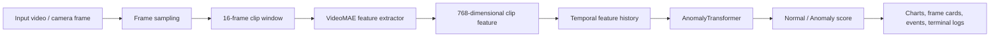
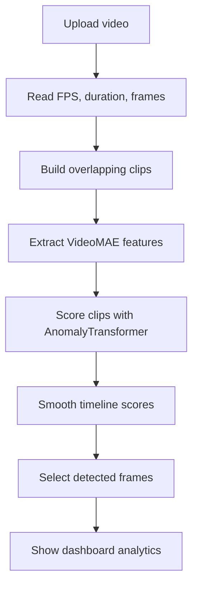
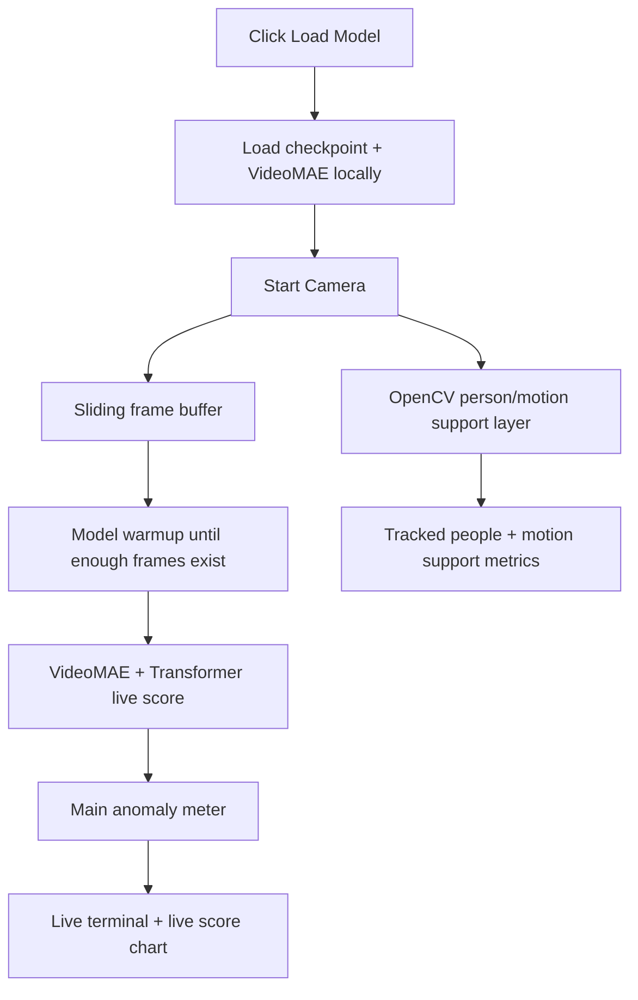
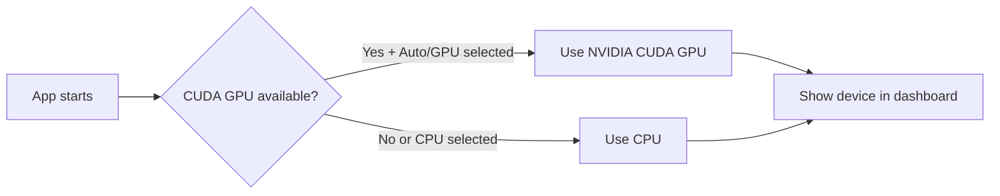

# NO API BULLSHIT

> In a world where everyone wraps an API and calls it AI, we build it from scratch: local model, local weights, local GPU, local inference.

# AVT / AnomalyGuard

AVT is an offline violence/anomaly detection desktop application built with a trained VideoMAE feature extractor and a custom Transformer classifier. It is designed to run locally on a laptop or PC without sending videos to a server.

The app includes:

- A PySide6 desktop UI.
- Local model weights packaged with the app.
- GPU/CPU selection.
- Uploaded video anomaly analysis.
- Real-time camera mode.
- Analysis terminal and live terminal.
- Timeline, worm/trend, score, coverage, detected-frame, and event-summary analytics.
- Windows installer output: `release/AVT-Setup.exe`.

## What This Is

| Part | What It Does |
|---|---|
| Desktop app | Local Windows UI for upload and live camera analysis |
| VideoMAE / ViT feature extractor | Converts video clips into 768-dimensional visual features |
| AnomalyTransformer | Scores temporal feature sequences as normal/anomaly |
| OpenCV live layer | Tracks people/motion as secondary live support |
| PyQtGraph charts | Fast desktop charts for timeline, trend, and summaries |
| PyInstaller + Inno Setup | Builds a shareable Windows installer |

## What This Is Not

| Not This | Because |
|---|---|
| Cloud API wrapper | Videos stay local |
| Browser-only demo | CUDA/GPU desktop runtime works better locally |
| Fake dashboard | The app loads real model weights and runs inference |
| Internet-dependent app | Model assets are shipped locally |

## Current Build Outputs

```text
dist/AVT/AVT.exe
release/AVT-Setup.exe
```

To share the application with another Windows laptop, share:

```text
release/AVT-Setup.exe
```

The installer includes the app, model checkpoint, local VideoMAE assets, Python runtime dependencies, OpenCV data, and UI files.

## Main Screenshots

### Desktop / Web Result Example


This screenshot shows the deployed result view: final prediction, anomaly score, timeline, detected samples, and score summary. The desktop app uses the same core runtime and checkpoint.

### Training Progress


This chart shows how the model trained over epochs:

| Chart Area | Meaning |
|---|---|
| Loss curve | Training/validation loss movement. Lower is better. |
| Accuracy curve | How often the model predicted correctly during validation. Higher is better. |
| ROC/AUC curve | Separates normal vs anomaly across thresholds. Higher AUC means stronger separation. |

### Test Evaluation


This screenshot explains final model quality:

| Evaluation View | Meaning |
|---|---|
| Confusion matrix | Normal/anomaly predictions compared with true labels |
| ROC curve | Classification quality across decision thresholds |
| Precision-recall curve | How reliable anomaly detections are when anomaly data is imbalanced |

### Per-Category Accuracy


This chart shows how well the trained model performs for each UCF-Crime category. Green bars represent normal behavior categories; red bars represent anomaly categories. It helps identify where the model is strong and where it may need more data or retraining.

### MP4 Inference Timeline


This chart is produced during video inference. Each segment is scored as an anomaly probability. Peaks show the moments where the model believes suspicious activity is most likely.

### Inference Frame Grid


This frame grid samples important frames from the analyzed video and attaches the nearest anomaly score. It helps users inspect what the model saw around high-risk moments.

## Model Pipeline



## Uploaded Video Workflow



## Real-Time Workflow



Important: the main live anomaly meter is model-led. Person/motion detection is secondary support for UI context, not the final anomaly decision.

## GPU / CPU Flow



The app supports:

| Mode | Behavior |
|---|---|
| Auto | Uses GPU when CUDA is available, otherwise CPU |
| GPU | Prefers CUDA GPU |
| CPU | Forces local CPU inference |

## Models

| Component | Details |
|---|---|
| Feature extractor | VideoMAE / ViT-style visual feature extractor |
| Feature size | 768 dimensions |
| Classifier | `AnomalyTransformer` temporal encoder |
| Checkpoint | `artifacts/checkpoints/best_model.pt` |
| Dataset | UCF-Crime feature dataset |
| Classes | Normal vs Anomaly |
| Runtime | PyTorch |
| Desktop UI | PySide6 |

### Transformer Classifier

The classifier uses temporal features rather than raw individual frames. This matters because violence/anomaly detection depends on motion and sequence context, not just one still image.

```text
Video frames
→ 16-frame clips
→ VideoMAE features
→ temporal feature sequence
→ Transformer classifier
→ anomaly probability
```

## Analytics Explained

| Analytics View | What It Means | Why It Matters |
|---|---|---|
| Prediction | Final normal/anomaly label | Quick decision for the user |
| Confidence | Strength of the final class decision | Helps judge reliability |
| Peak Score | Highest anomaly probability in the video | Finds the most suspicious moment |
| Average Score | Mean anomaly score across clips | Shows overall video risk |
| Anomaly Coverage | Percent of video marked above threshold | Tells whether anomaly is isolated or widespread |
| Timeline Graph | Anomaly score over time | Locates when suspicious activity happens |
| Worm Graph | Smoothed moving trend of anomaly scores | Easier to see rising/falling threat patterns |
| Detected Frames | Sampled frames near scored moments | Lets user visually inspect model evidence |
| Event Summary | Compact score/coverage charts | Gives final report-style overview |
| FPS | Video/camera processing rate | Shows runtime performance |
| Latency | Time per inference/update | Critical for real-time use |
| GPU/CPU Device | Active compute device | Confirms whether CUDA is used |
| Live Terminal | Runtime logs for live mode | Shows model warmup, score source, and status |
| Analysis Terminal | Upload-analysis logs | Shows model loading and pipeline progress |

## Chart Guide

| Chart | Normal Color | Anomaly Color | Explanation |
|---|---|---|---|
| Timeline Graph | Green | Red | Segment-level anomaly score over seconds |
| Worm Graph | Green | Red | Smoothed trend over segment order |
| Event Summary Bars | Green | Red | Summary of prediction, peak, and average score |
| Coverage Bar | Green/Red based on score | Red when high anomaly coverage | Percent of video above threshold |
| Live Score Trend | Green | Red | Recent real-time model scores |

The dashed line in score charts is the selected threshold. Any score above that line is treated as anomaly.

## Desktop UI Sections

| Section | Purpose |
|---|---|
| Top controls | Sensitivity, threshold, device mode, model loading, video upload, camera, info, day/night theme |
| Video Analysis tab | Uploaded video playback and full analytics |
| Real Time tab | Camera feed, live anomaly score, tracked people, live terminal |
| Analysis Workflow | Shows queued → runtime → frames → features → scoring → completed |
| Analysis Terminal | PowerShell-style upload analysis logs |
| Live Terminal | Real-time camera/model status logs |
| Model & Training Info | Training metrics, category list, screenshots |

## Day / Night Theme

The app includes a top-bar theme button:

| Button | Result |
|---|---|
| Day | White/black interface |
| Night | Black/white interface |

Red and green are reserved for anomaly/normal status only.

## Project Structure

```text
vad_project_app/
  app.py
  README.md
  requirements.txt
  requirements-desktop.txt
  src/
    vad_platform/
      config.py
      detector.py
      model.py
  desktop_app/
    main.py
    workers.py
    live_intelligence.py
    ui/main_window.py
  artifacts/
    checkpoints/best_model.pt
    models/videomae-base/
    reports/
  docs/
    desktop-app.md
    windows-installer.md
    screenshots/
  packaging/
    avt_desktop.spec
    installer.iss
  scripts/
    desktop_smoke_test.py
    build_windows_installer.ps1
  tests/
    test_smoke.py
  dist/
    AVT/AVT.exe
  release/
    AVT-Setup.exe
```

## Run From Source

```powershell
pip install -r requirements.txt
pip install -r requirements-desktop.txt
python -m desktop_app.main
```

On the development machine used for this build:

```powershell
C:\Users\USER\AppData\Local\Programs\Python\Python312\python.exe -m desktop_app.main
```

## Build Desktop App

```powershell
C:\Users\USER\AppData\Local\Programs\Python\Python312\python.exe -m PyInstaller --noconfirm packaging\avt_desktop.spec
```

Output:

```text
dist/AVT/AVT.exe
```

## Build Installer

```powershell
& "C:\Users\USER\AppData\Local\Programs\Inno Setup 6\ISCC.exe" packaging\installer.iss
```

Output:

```text
release/AVT-Setup.exe
```

## Verification

Run tests:

```powershell
C:\Users\USER\AppData\Local\Programs\Python\Python312\python.exe -m unittest discover -s tests -v
```

Run desktop smoke test:

```powershell
C:\Users\USER\AppData\Local\Programs\Python\Python312\python.exe scripts\desktop_smoke_test.py
```

Run packaged live-model smoke:

```powershell
dist\AVT\AVT.exe --smoke-live-model
```

Expected marker:

```text
SMOKE_LIVE_MODEL_OK
```

## Offline Behavior

The desktop app is designed to work without internet after installation:

| Asset | Location |
|---|---|
| Classifier checkpoint | `artifacts/checkpoints/best_model.pt` |
| VideoMAE local model | `artifacts/models/videomae-base/` |
| OpenCV cascade files | bundled under app internals |
| UI assets/code | bundled in installer |

No external model API is required for inference.

## Notes For Future Improvements

| Improvement | Why |
|---|---|
| ONNX/TensorRT export | Faster inference and smaller runtime |
| YOLO/MediaPipe person detector | Stronger real-time person detection |
| Dedicated emotion model | More accurate expression/emotion labels |
| Larger violence-specific training set | Better real-world generalization |
| RTSP camera support | CCTV/IP camera deployment |
| PDF/CSV reports | Professional export workflow |

## Final Line

NO API BULLSHIT.  
No rented intelligence pretending to be engineering.  
Local model. Local weights. Local GPU. Built from scratch.
