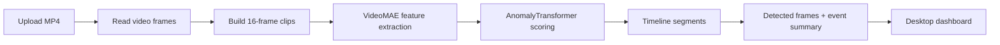
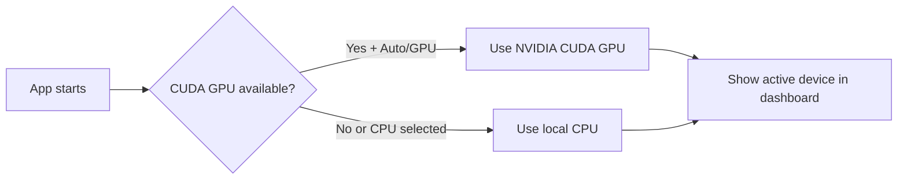

# No API Bullshit!!
# Vision Transformer Violence Detection Platform 

A Flask-based violence/anomaly detection platform using a trained VideoMAE feature
extractor plus the project `AnomalyTransformer` checkpoint.

The repository now also includes **AnomalyGuard**, a local PySide6 desktop app
for offline video anomaly detection with GPU/CPU selection, live analysis
terminal output, workflow tracking, video preview controls, timeline analytics,
detected-frame cards, and visual score summaries.

## Project Layout

```text
vad_project/
  app.py                         # Root entrypoint: python app.py
  requirements.txt               # Python dependencies
  src/
    vad_platform/                # Runtime package
      config.py                  # Thresholds, model paths, runtime config
      detector.py                # Live/video inference service
      model.py                   # AnomalyTransformer architecture
  desktop_app/                   # PySide6 offline desktop application
    main.py                      # Desktop entrypoint: python -m desktop_app.main
    workers.py                   # QThread workers for runtime/video/camera analysis
    ui/main_window.py            # Main dashboard, graphs, terminal, and dialogs
  web/
    templates/index.html         # Browser dashboard
    static/app.js                # Camera, upload, API UI logic
    static/styles.css            # Dashboard styles
  scripts/
    desktop_smoke_test.py        # Headless desktop UI/inference smoke test
    preprocessing/               # Feature checks and consolidation
    training/                    # SRU/SRU++ training scripts
  artifacts/
    checkpoints/best_model.pt    # Deployed trained checkpoint
    features/                    # Consolidated embeddings/labels
    models/                      # SRU/SRU++ training outputs
    reports/                     # Charts, timelines, evaluation outputs
    logs/                        # Training/runtime logs
  data/
    UCF-Crime_dataset/           # UCF-Crime feature dataset
    samples/                     # Test/sample MP4 files
  notebooks/                     # Original training/inference notebooks
  requirements-desktop.txt       # Desktop UI dependencies
```

## Run

```bash
pip install -r requirements.txt
python app.py
```

Open:

```text
http://127.0.0.1:5000
```

## Desktop App

The project also includes a local PySide6 desktop client for offline-first video
analysis:

```bash
pip install -r requirements-desktop.txt
python -m desktop_app.main
```

See `docs/desktop-app.md` for desktop packaging and offline model notes.
See `docs/windows-installer.md` for building a shareable `AVT-Setup.exe`.

If your default `python` points to an environment without PySide6, run the app
with the Python interpreter where desktop dependencies are installed. On the
development machine used here:

```powershell
C:\Users\USER\AppData\Local\Programs\Python\Python312\python.exe -m desktop_app.main
```

### Desktop Features

- Offline local inference with the shipped checkpoint.
- Auto / GPU / CPU runtime selection.
- Sensitivity slider and exact threshold control.
- Model load progress and PowerShell-style analysis terminal.
- Analysis workflow pipeline with queued, runtime, frames, features, scoring,
  and completed states.
- Video preview with play/pause, seek/progress bar, timestamp, and optional
  audio through `PySide6-Addons`.
- Timeline graph, worm/trend graph, coverage chart, event summary, and score
  summary chart.
- Detected-frame cards with time, normal/anomaly label, and score percentage.
- Model/training info dialog with training screenshots.

### Desktop Analysis Pipeline



Runtime device selection:



The app loads:

```text
artifacts/checkpoints/best_model.pt
```

If CUDA PyTorch is installed, the backend uses the NVIDIA GPU automatically.

The original notebook was run with PyTorch `2.5.1`. This app is compatible with
PyTorch `2.5.1+` and explicitly handles the PyTorch `2.6+` checkpoint loading
change. Inference uses FP32 by default to keep scores closer to the notebook.

## Dependency Checks

Runtime dependencies:

```bash
pip install -r requirements.txt
python -m unittest discover -s tests -v
```

Optional SRU/SRU++ training dependencies:

```bash
pip install -r requirements-training.txt
```

Optional browser export dependencies:

```bash
pip install -r requirements-export.txt
python scripts/export/export_browser_models.py
```

Browser-side ONNX artifacts are stored under:

```text
web/static/models/browser/
  manifest.json
  videomae_feature_extractor.onnx
  anomaly_transformer.onnx
```

The browser analyzer uses ONNX Runtime Web with WebGPU when available and falls
back to WASM otherwise. The server analyzer remains available as the reliable
fallback for browsers or devices that cannot load the larger client models.

On Windows, SRU requires MSVC Build Tools (`cl`) and a CUDA toolkit for its JIT
kernels. The deployed platform does not need SRU.

## Features

- Live browser camera scoring
- Upload MP4 analysis
- Segment timeline and peak threat score
- Separate live and upload sensitivity controls
- Live alert hysteresis to avoid low-score alert spam
- Optional Screen Focus mode for testing with a video playing on another screen
- Offline PySide6 desktop dashboard
- GPU/CPU runtime selection
- Desktop analysis terminal and pipeline visualization
- Detected frame gallery and event summary charts

## Screenshots

The training and MP4 inference notebooks in `notebooks/` were used to produce
the process and result screenshots below.

### Desktop/Runtime Example

The desktop app reuses the same runtime and checkpoint as the Flask dashboard.
After upload, the pipeline reads frames, extracts VideoMAE features, scores
temporal segments, and visualizes the final anomaly timeline with sampled frames.


This example result view shows the end-to-end output users should expect in the
desktop app too: final prediction, peak score, timeline, and frame examples.

### Training Process

`notebooks/UCF_Crime_Anomaly_Detection_Training.ipynb` trains the temporal
Transformer on extracted UCF-Crime VideoMAE/ViT features, tracks validation
metrics, and saves the best checkpoint to `artifacts/checkpoints/best_model.pt`.


The desktop app's **Info** dialog includes this training screenshot so users can
quickly inspect how the model learned over epochs.

### Training Results

The same notebook evaluates the best checkpoint with confusion matrix, ROC, PR,
and per-category accuracy reports.


These results are also shown inside the desktop **Model & Training Info** dialog
to explain model quality and category behavior.

### MP4 Inference Process

`notebooks/Anomaly_Detection_MP4_Inference_VideoMAE.ipynb` loads an MP4, builds
overlapping 16-frame clips, extracts VideoMAE features, and scores the video
with the trained anomaly model.


### Web Result View

The Flask dashboard at `http://127.0.0.1:5000/` displays the deployed result
view for an uploaded sample MP4, including the peak threat score and timeline.


## Verification

Run backend tests:

```bash
python -m unittest discover -s tests -v
```

Run the desktop smoke test using an interpreter with PySide6 installed:

```powershell
C:\Users\USER\AppData\Local\Programs\Python\Python312\python.exe scripts\desktop_smoke_test.py
```

Expected smoke-test markers:

```text
UI_ANALYSIS_DONE ANOMALY 40 100
TERMINAL_HAS_RUNTIME True
TERMINAL_HAS_DONE True
```

Build the Windows desktop bundle and installer:

```powershell
.\scripts\build_windows_installer.ps1
```

This produces `dist/AVT/AVT.exe` and, when Inno Setup is installed,
`release/AVT-Setup.exe`. If Inno Setup is unavailable, the script creates
`release/AVT-portable.zip` as a shareable fallback.

## API

| Endpoint | Method | Purpose |
|---|---|---|
| `/api/health` | GET | Runtime, checkpoint, GPU, threshold status |
| `/api/live-frame` | POST | Score one live camera frame in rolling context |
| `/api/analyze-video` | POST | Upload and analyze a video |
| `/api/reset` | POST | Clear live buffers and alert history |

## Training Utilities

Check consolidated feature files:

```bash
python scripts/preprocessing/check_features.py \
  --embeddings artifacts/features/embeddings.npy \
  --labels artifacts/features/labels.npy
```

Consolidate VideoMAE feature folders:

```bash
python scripts/preprocessing/preprocess_videomae_features.py
```

Train SRU:

```bash
python scripts/training/sru_training.py \
  --embeddings_path artifacts/features/embeddings.npy \
  --labels_path artifacts/features/labels.npy \
  --input_size 768 \
  --num_classes 2 \
  --hidden_size 512 \
  --num_layers 2 \
  --epochs 100 \
  --batch_size 16 \
  --learning_rate 0.001 \
  --save_dir artifacts/models
```

Train SRU++:

```bash
python scripts/training/srupp_training.py \
  --embeddings_path artifacts/features/embeddings.npy \
  --labels_path artifacts/features/labels.npy \
  --input_size 768 \
  --num_classes 2 \
  --hidden_size 512 \
  --proj_size 384 \
  --num_layers 2 \
  --epochs 100 \
  --batch_size 16 \
  --learning_rate 0.001 \
  --save_dir artifacts/models
```
